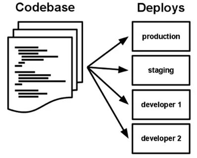

## I. Кодовая база

#### Одна кодовая база, отслеживаемая в системе контроля версий, – множество развёртываний.

Приложение при удовлетворяющее требованиям двенадцати факторов всегда отслеживается в системе контроля версий, таких как [Git](http://git-scm.com/), [Mercurial](https://www.mercurial-scm.org/) или [Subversion](http://subversion.apache.org/). Копия базы данных отслеживаемых версий называется *репозиторием кода* (*code repository*), что часто сокращается до *code repo* или просто до *репозиторий* (*repo*).

*Кодовая база* – это один репозиторий (в централизованных системах контроля версий, как Subversion) или множество репозиториев, имеющих общие начальные коммиты (в децентрализованных системах контроля версий, как Git).

Всегда есть однозначное соответствие между кодовой базой и приложением:

* Если есть несколько кодовых баз, то это не приложение — это распределённая система. Каждый компонент в распределённой системе является приложением и каждый компонент может индивидуально соответствовать двенадцати факторам.

* Факт того, что несколько приложений совместно используют тот же самый код, является нарушением двенадцати факторов. Решением в данной ситуации является выделение общего кода в библиотеки, которые могут быть подключены через [менеджер зависимостей](02_dependencies.md).

Существует только одна кодовая база для каждого приложения, но может быть множество развёртываний одного и того же приложения. Развёрнутым приложением (*deploy*) является запущенный экземпляр приложения. Как правило, это рабочее развёртывание сайта и одно или несколько промежуточных развёртываний сайта. Кроме того каждый разработчик имеет копию приложения, запущенного в его локальном окружении разработки, каждая из которых также квалифицируется как развёрнутое приложение (*deploy*).

Кодовая база обязана быть единой для всех развёртываний, однако разные версии одной кодовой базы могут выполняться в каждом из развёртываний. Например разработчик может иметь некоторые изменения которые ещё не добавлены в промежуточное развёртывание; промежуточное развёртывание может иметь некоторые изменения, которые ещё не добавлены в рабочее развёртывание. Однако, все эти развёртывания используют одну и ту же кодовую базу, таким образом можно их идентифицировать как разные развёртывания одного и того же приложения.

| ← Назад | ☰ К началу | Далее → |
|:--------|:-----------:|--------:|
| Начало | [Содержание](README.md) | [II. Зависимости](02_dependencies.md) |