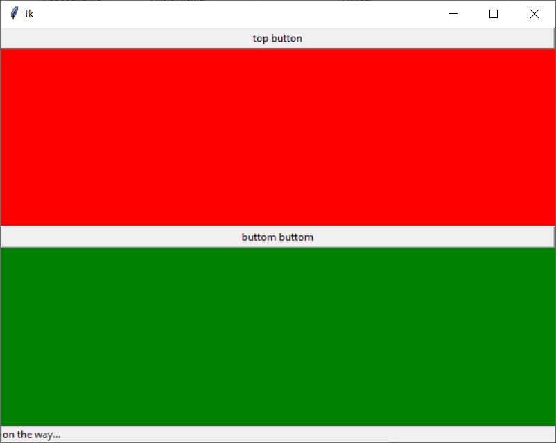

## Python. Tkinter. Вертикальная компоновка из 3х элементов (user-control, process-journal, statusbar)

### Оговорки
1. Готова только канва ui;
2. Выкладываю только `source`-код (разъяснения смогу выложить похже, когда доделаю интерфейс).

Структура проекта следующая:
```
[project-name]
       ├───framework
       │   └───ui.py
       └───main.py
```

Содержание файла `main.py`
```python
from framework.ui import *


if __name__ == "__main__":
    frame = CustomFrame()
    frame.show()
```

Содержание фала `framework\ui.py`
```python
from tkinter import *

class CustomFrame():
    def __init__(self):
        self.root = Tk()
        self.root.geometry("640x480")

        self.init_components()


    def show(self):
        self.root.rowconfigure(0, weight=1)
        self.root.rowconfigure(1, weight=1)
        self.root.columnconfigure(0, weight=1)

        self.root.mainloop()


    def init_components(self):
        frame_control   = Frame(self.root, bg="red")
        frame_logstat   = Frame(self.root, bg="green")

        # init `frame-control` ui-controls
        btn1            = Button(frame_control, text="top button")
        btn1            .pack(fill="both")

        # init `frame-logger` ui-controls
        btn2            = Button(frame_logstat, text="buttom buttom")
        statusbar       = Label(frame_logstat, text="on the way...", bd=1, relief=SUNKEN, anchor=W)
        btn2            .pack(fill="both")
        statusbar       .pack(side=BOTTOM, fill=X)
        
        frame_control   .grid(row=0, column=0, sticky="nsew")
        frame_logstat   .grid(row=1, column=0, sticky="nsew")
```

